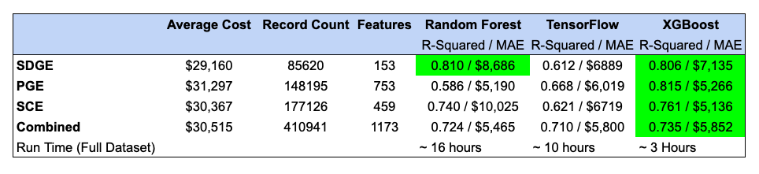

# Solar Installation Cost Modeling

Making use of machine learning techniques to predict the cost of installing solar panels on residential homes in California.

## Description

Predictive models that leverages factors like location, utility company, installer, and desired kwh were trained to estimate the cost of solar panel installation on residential homes. The California [Distributed Generation  Interconnection Data Sets](https://www.californiadgstats.ca.gov/downloads/) consisting of  over 1M records, from 2018-2023 was used. After extracting, cleaning and normalizing, various models were trained on three separate datasets (one for each utility company) totaling over 410K records, and up 753 features, after one-hot-encoding the categorial variables. The machine learning techniques employed were XGBoost, Random Forest, Gradient Boosting and a TensorFlow Neural Network. These models allow for identifying which utility/installers offers the best value for solar panel installation, based primarily on the desired power output and location. In addition, a clean dataset containing the merged records was imported into both a SQLite and PostgreSQL database to make it easier to use this dataset in other projects. Finally, a simple Flask based interactive website was developed to show case model/database deployment and use. 

[Interactive Map](https://public.tableau.com/views/SolarCostMap/Map?:language=en-US&publish=yes&:display_count=n&:origin=viz_share_link)

## Getting Started

### Dependencies for Machine Learning Jupyter Notebooks
1. Scikit-Learn
2. XGBoost
3. TensorFlow/Keras

### Dependencies for Flask web-app
1. Flask
2. Flask-CORS
3. SQLAlchemy
4. PostgreSQL or SQlite3

### Clean Dataset and Database Files
Download here: [Solar Cost Data](https://github.com/ns96/ML_Project/releases/tag/v1.0)

### Installing Database Files 

Database Files Importing.
* PostgresSQL (recommended): 
	1. Using pgAdmin create a database called "SolarCostData"
	2. Run the QuickDBD-SQL.sql
	4. update the flask/app.py with the proper credentials for the PostgreSQL database. Make sure to uncomment this line, and comment the SQLite line.
* SQlite:
	1. Edit the app.py file to point to the location where the SolarCostData.sqlite3 files was installed.

### Executing Flask backend

1. Download source code from GitHub
2. Change to "installation location"/flask directory
3. Execute "python app.py"
4. Open http://localhost:5015/view in Browser 

[Live Demo](http://pi86.sytes.net:5015/view)

## Model Performance

In order to achieve the best model performance, training was done on datasets for each Utility separately, using a 30/70 test/train split for all. Training on a merged dataset was also done, but as expected, the perfomance was less than for the separately trained models. As far as training time, the XGBoost models required far less time to train/test than the other models. The results for the R-squared and mean absolute errors (mae) are shown below.

## Conclusions

By making use of various machine learning techniques and the Distributed Generation  Interconnection Data Sets from California, numerous machine learning models were trained and tested. Overall, the ML models did show promise for predicting solar panel installation cost based on location, installer and desired power output. However, given the best R-squared value was only about 0.81, and the mean absolute error was above $5,000 work still remains before these models can be put into a production environment. 

## Authors

Contributors names and contact info

* Elena Lomako
* Nathan Stevens
* Cameron Cullen
* Eric Llorente 

## Version History
* 1.0.0
    * Initial Release

## License

This project is licensed under the GPL License

## Acknowledgments
Various tutorials, frameworks, libraries, and database tools/engines used:

* [scikit-learn](https://scikit-learn.org/stable/index.html)
* [XGBoost](https://xgboost.ai/)
* [TensorFlow](https://www.tensorflow.org/)
* [Tableau Public](https://www.tableau.com/products/public)
* [Flask Micro Framework](https://flask.palletsprojects.com/en/3.0.x/)
* [Flask-CORS](https://flask-cors.readthedocs.io/en/latest/) 
* [Leaflet](https://leafletjs.com/)
* [Plotly](https://plotly.com/javascript/)
* [Grid.js](https://gridjs.io/)
* [SQLAlchemy](https://www.sqlalchemy.org/)
* [SQlite3](https://www.sqlite.org/index.html)
* [SQLiteStudio](https://sqlitestudio.pl/)
* [DB Browser for SQLite](https://sqlitebrowser.org/)
* [PostgreSQL](https://www.postgresql.org/)
* [Dumping PostgreSQL DB](https://www.netguru.com/blog/how-to-dump-and-restore-postgresql-database). On MacOs you may need to run 'export PATH=$PATH:/Library/PostgreSQL/16/bin'
* [Home Squarefoot -> Kwh Estimation](https://www.lifestylesolarinc.com/blog/how-many-kwh-does-a-house-use-per-day)